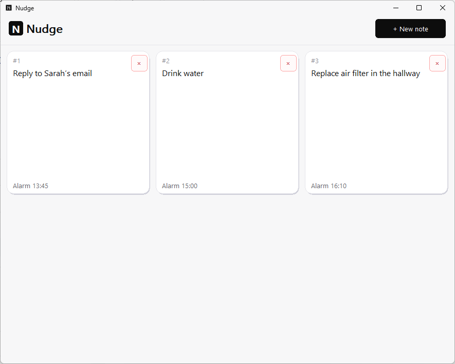
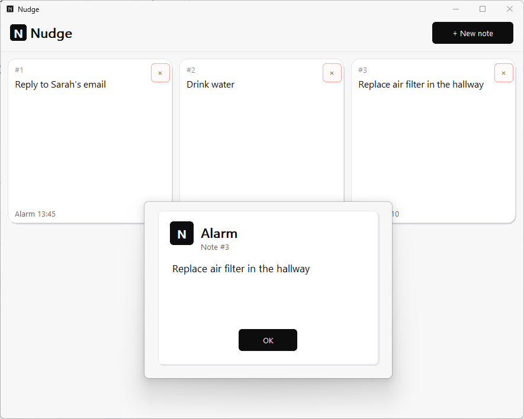
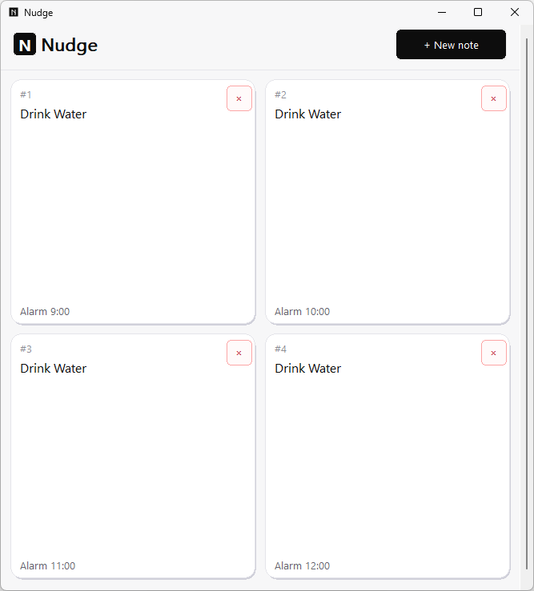

# Nudge

> A small **Windows** app for quick notes and time-based reminders. It lives in the **system tray** and saves everything **locally** on your PC.

---

## Table of Contents
1. [Usage](#1-usage)
2. [Previews](#2-previews)
3. [Features](#3-features)

---

## 1. Usage

Download **`Nudge.exe`**, run it, and allow it to start with Windows if you want. No installer required.

---

## 2. Previews

---

## 3. Features

* **Lightweight & Portable:** No installation required, just run the executable.
* **System Tray Integration:** Stays out of your way until you need it.
* **100% Private:** All your notes and reminders are saved locally on your machine.
